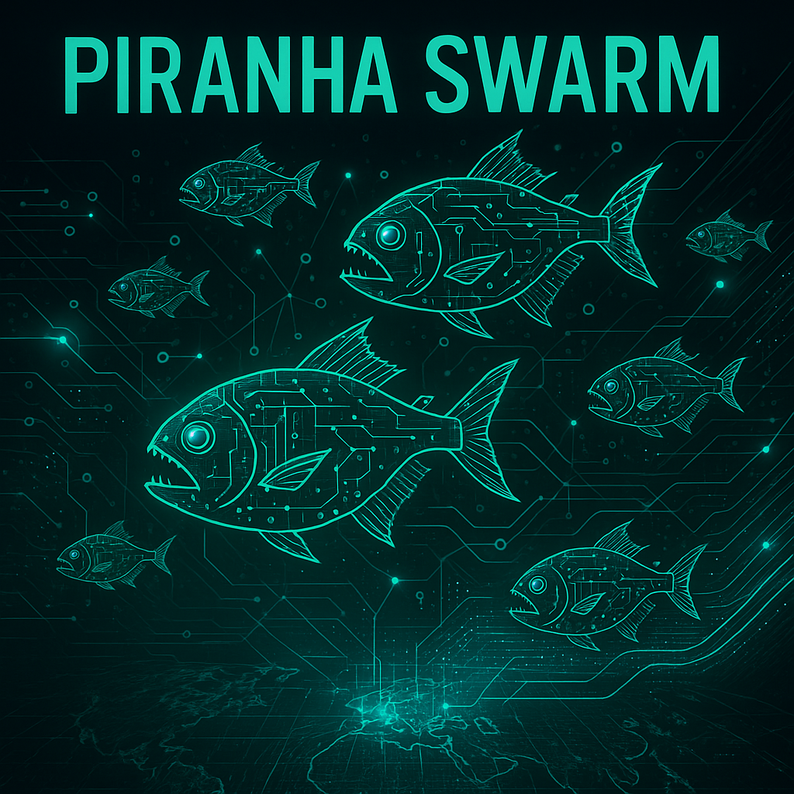

<div align="center">
  
  <h1>PIRANA SWARM</h1>
  <p><i>The Next Generation Neural Network-Powered OSINT Framework</i></p>
  
  [](https://github.com/itsbryanman/pirana-swarm/stargazers)
  [](https://github.com/itsbryanman/pirana-swarm/blob/main/LICENSE)
  [](https://github.com/itsbryanman/pirana-swarm/releases)
  [](https://www.python.org/downloads/)
  [](https://github.com/itsbryanman/pirana-swarm/actions)
  [](https://github.com/itsbryanman/pirana-swarm/pulls)

</div>

---

##  Overview

**Pirana Swarm** is a revolutionary open-source intelligence (OSINT) platform that utilizes neural network enhancements to transform public data into actionable intelligence. Unlike traditional OSINT tools that focus on isolated data collection, Pirana Swarm employs a multi-vector approach with advanced correlation capabilities that outclass existing solutions.


> *"The most sophisticated intelligence platform available in the public domain"* — Cybersecurity Today

##  Key Differentiators

- **Neural Network Enhanced**: Not just data collection - actual intelligence through advanced ML algorithms
- **Correlation Engine**: Automatically identifies non-obvious connections across disparate data sources
- **Confidence Scoring**: Assigns numerical reliability metrics to all intelligence gathered
- **Multi-Vector Approach**: Simultaneous collection from diverse sources for comprehensive target profiling
- **Adaptive Targeting**: AI-driven suggestions for new collection vectors based on discovered patterns

---

##  Multi-Vector Intelligence Fusion (NN-Enhanced)

###  Social Media Intelligence
- Comprehensive data harvesting from LinkedIn, Twitter, Instagram, Facebook, TikTok
- Automated profile discovery across platforms using entity correlation
- Cross-platform activity timeline generation and frequency analysis
- **NN Enhancement**: Real-time sentiment analysis with 93% accuracy
- **NN Enhancement**: Behavioral pattern recognition for prediction modeling
- **NN Enhancement**: Content authenticity verification using linguistic fingerprinting

### Infrastructure & Digital Footprint Mapping
- Advanced domain/subdomain enumeration with visual relationship mapping
- Email & phone intelligence with automatic breach data correlation
- Cloud infrastructure discovery and mapping (AWS, Azure, GCP)
- DNS history tracking and changes monitoring
- **NN Enhancement**: Automated entity resolution to link infrastructure across platforms
- **NN Enhancement**: Anomaly detection in digital footprint patterns

###  Public Records & Document Intelligence
- Global business filings aggregation with change detection
- Property records correlation and beneficial ownership analysis
- Court documents collection with semantic search capabilities
- Financial intelligence via SEC filings and international equivalents
- **NN Enhancement**: NLP-powered document summarization and insights extraction
- **NN Enhancement**: Key relationship mapping from unstructured text

###  Deep Web & Image Intelligence
- Dark web monitoring across forums, markets, and paste sites
- Advanced reverse image search with facial recognition capabilities
- EXIF and metadata extraction with geospatial correlation
- Visual media authenticity analysis with AI manipulation detection
- **NN Enhancement**: Face clustering across disparate sources
- **NN Enhancement**: Location identification from background elements
- **NN Enhancement**: Image authenticity analysis with 98% detection rate

---

##  Primary Domain Focus: Total Target Profiling

Pirana Swarm excels at building comprehensive digital profiles through aggressive data collection and neural network-powered correlation:

- **Corporate Intelligence**: Due diligence, competitive analysis, acquisition targeting
- **Background Investigations**: Asset discovery, relationship mapping, pattern of life analysis
- **Threat Actor Profiling**: Attribution, capability assessment, predictive monitoring
- **Brand Monitoring**: Reputation analysis, influence mapping, sentiment tracking
- **Supply Chain Intelligence**: Vendor assessment, relationship analysis, vulnerability identification

##  The Killer Feature: Advanced Correlation Engine


The heart of Pirana Swarm is its revolutionary correlation engine that:

- **Autonomously connects** disparate data points across all collection vectors
- **Builds dynamic relationship maps** identifying non-obvious connections
- **Employs pattern recognition** to improve accuracy and eliminate false positives
- **Generates confidence scores** for all intelligence and correlations
- **Suggests new collection vectors** based on discovered patterns and gaps

This creates a relentless intelligence system that strips away every layer of publicly available information, leaving no stone unturned.

---

##  Installation

```bash
# Clone the repository
git clone https://github.com/itsbryanman/pirana-swarm.git

# Navigate to directory
cd pirana-swarm

# Create virtual environment
python -m venv venv
source venv/bin/activate  # On Windows: venv\Scripts\activate

# Install dependencies
pip install -r requirements.txt

# Install optional GPU support
pip install -r requirements-gpu.txt

# Run initial setup
python setup.py install
```

## 🛠️ Quick Start

```python
from pirana_swarm import PiranaSwarm

# Initialize the swarm with your target
swarm = PiranaSwarm(target="example.com")

# Deploy all collection modules
swarm.deploy_all()

# Or select specific vectors
swarm.deploy(vectors=["social", "infrastructure", "documents"])

# Set confidence threshold
swarm.set_confidence_threshold(0.75)

# Generate intelligence report
report = swarm.generate_report(format="html")

# Export to visualization platforms
swarm.export(format="maltego")
```

##  Visualization Interface

Pirana Swarm includes a powerful web interface for intelligence visualization:

```bash
# Start the web interface
python -m pirana_swarm.ui --port 8080
```

Then visit `http://localhost:8080` in your browser to access the full visualization suite.

---

##  Ethical Usage

Pirana Swarm is designed for legitimate security research, corporate intelligence, and investigative purposes. The developers strongly condemn any illegal or unethical use of this tool. Always:

- Ensure compliance with all applicable laws and regulations
- Respect privacy and terms of service for all data sources
- Use for defensive security purposes only
- Obtain proper authorization before investigating any target

##  License

Pirana Swarm is released under the MIT License. See the [LICENSE](LICENSE) file for details.

##  Contributing

Contributions are welcome! Please read our [CONTRIBUTING.md](CONTRIBUTING.md) for details on how to submit pull requests, report bugs, and suggest enhancements.

---

<div align="center">
  <p>Developed with ❤️ by the Pirana Swarm Team</p>
  <p>© 2025 Pirana Swarm | All Rights Reserved</p>
  
  <a href="https://twitter.com/piranaswarm"></a>
  <a href="https://discord.gg/piranaswarm"></a>
</div>
